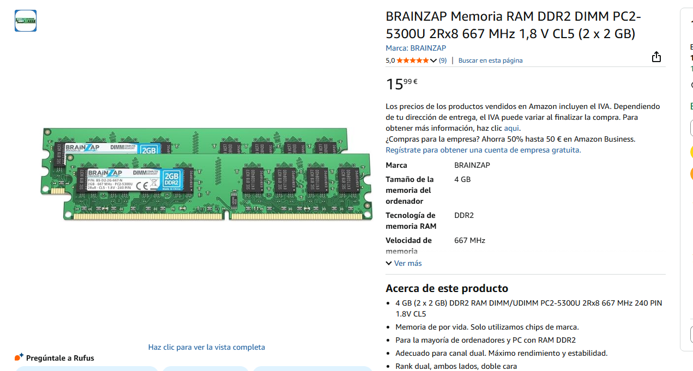
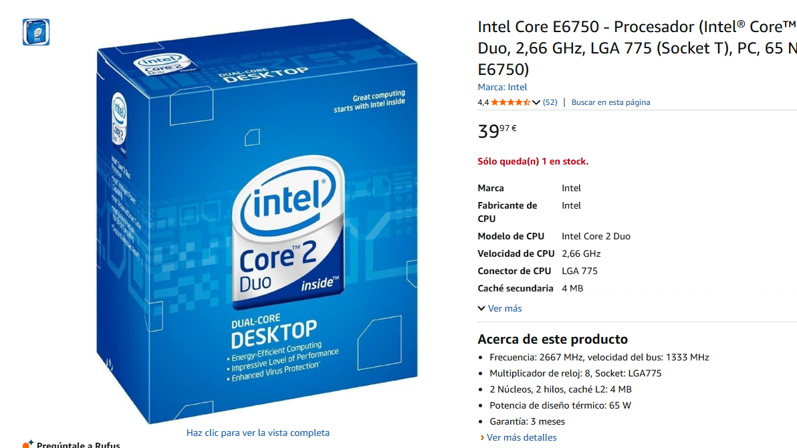
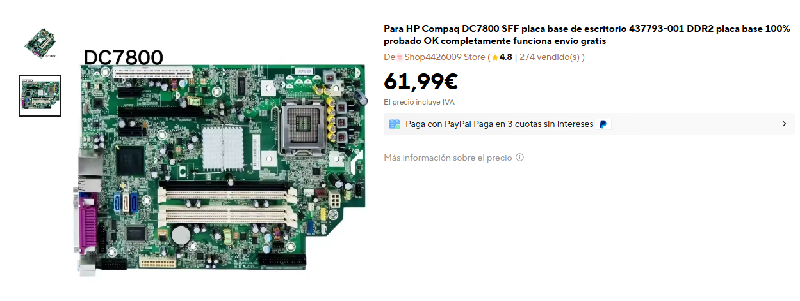

# 30 — Mercado y recambios

> Imagina que el equipo falla. Selecciona **tres** componentes para recambio.

- **Componente a sustituir:CPU, Placa Base, RAM**  
- **¿Existe el mismo modelo exacto en tiendas?** (Sí / No / Solo segunda mano): Sí
- **Alternativa compatible (socket/ranura):Intel Core 2 Quad Q9550, ASUS P5KPL-Am SE LGA 775, BRAINZAP 5300U**  
- **Precio aproximado (€):CPU nueva 39,97€. Placa nueva 61,99€. RAM nueva 15,99€**  
- **URL:CPU --> https://www.amazon.es/dp/B000R9BJ2C?ref_=cm_sw_r_cso_wa_apan_dp_8X8REK3JJG76WBF6WBHP Placa Base --> https://es.aliexpress.com/item/1005008636526118.html?invitationCode=aGpaM0RsTU5LSVlBUDVWSkplMkw5OU56WmNyd3E4TmJBbmx1U0U4L0F0bWVQemFTZUJrNWVWT0s1MU1hdTAyWg&srcSns=sns_WhatsApp&spreadType=socialShare&social_params=61397287410&bizType=ProductDetail&spreadCode=aGpaM0RsTU5LSVlBUDVWSkplMkw5OU56WmNyd3E4TmJBbmx1U0U4L0F0bWVQemFTZUJrNWVWT0s1MU1hdTAyWg&aff_fcid=c296a492dc0d4381b665cb452631e537-1769634471233-04355-_EJlNIsG&tt=MG&aff_fsk=_EJlNIsG&aff_platform=default&sk=_EJlNIsG&aff_trace_key=c296a492dc0d4381b665cb452631e537-1769634471233-04355-_EJlNIsG&shareId=61397287410&businessType=ProductDetail&platform=AE&terminal_id=76f4c3e4c3c642ccb294e636ab300434&afSmartRedirect=y Memoria RAM --> https://www.amazon.es/BRAINZAP-Memoria-DDR2-DIMM-PC2-5300U/dp/B0B2WY3WFV**  
- **Captura:**   

**Justificación breve:La CPU es compatible porque es la misma. La Placa Base es compatible con la CPU porque usa el mismo socket que la CPU ya montada. La RAM es compatible porque cumple con el estándar PC2-5300U a 667MHz y respeta el voltaje de 1,8V.** 
