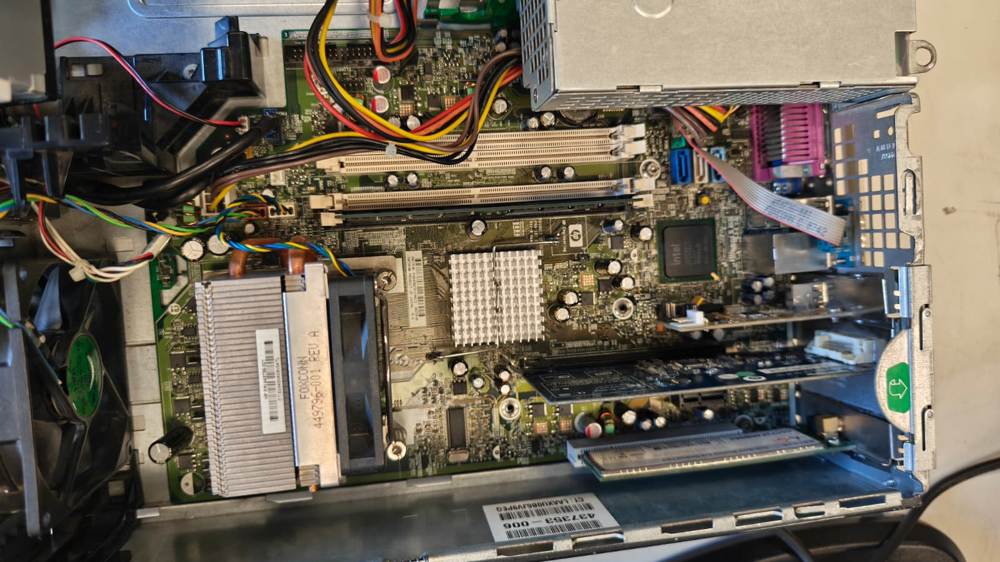
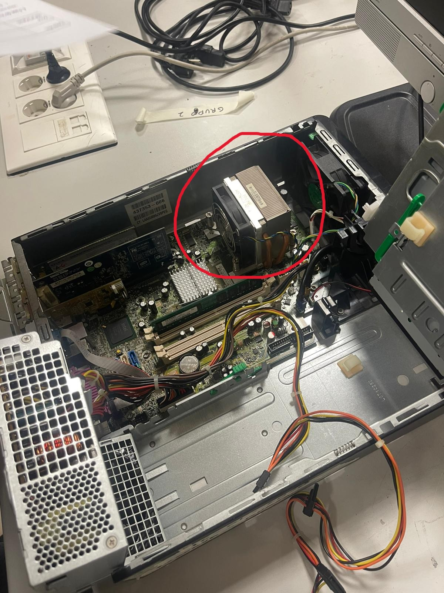
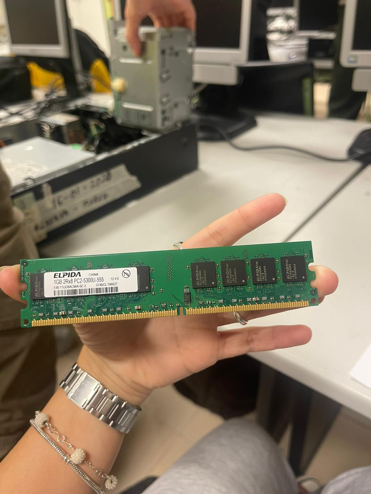
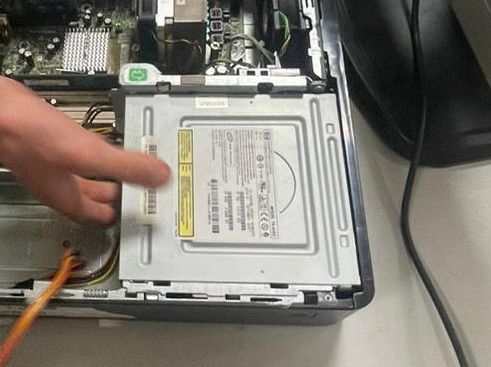
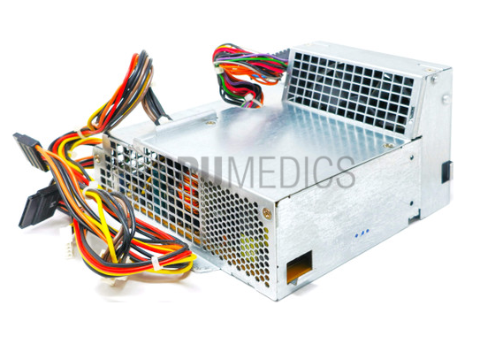

# 90 — ENTREGA ÚNICA (consolidado)

Copia aquí lo esencial de **toma de datos**, **investigación técnica**, **recambios** y **observaciones**, con las **imágenes clave** (rutas relativas).

## Portada
# 00 — Portada
- Alumno/a: Ugo Pérez Ruiz
- Puesto/Equipo asignado: Grupo 2
- Fecha: 28/01/2026
- Módulo: **Fundamentos de Hardware (1º ASIR)**
- Unidad: **UT3 — Ensamblado de equipos**
- Reto: **Reto 01 — Práctica de Taller**

## Indice
# 01 — Índice
1. [Portada](00-portada.md)
2. [Instrucciones](02-instrucciones.md)
3. [Toma de datos en taller](10-toma_de_datos/plantilla_tabla_taller.md)
4. [Investigación técnica](20-investigacion_tecnica/plantilla_investigacion.md)
5. [Mercado y recambios](30-mercado_y_recambios/plantilla_recambios.md)
6. [Observaciones personales](40-observaciones/plantilla_observaciones.md)
7. [ENTREGA ÚNICA](90-ENTREGA_UNICA.md)
8. [Checklist](99-entrega_y_checklist.md)
---
## Toma de datos — resumen

| Componente     | Marca/Fabricante   | Modelo/Serie | Características técnicas visibles                         | Foto                                        |

| **Placa base** |HP                  |DC 7800 SF  | Chipset Intel Q35 Express, LGA 775, Slots RAM 4             |  

| **Microprocesador** | Intel         | i2 E6750    | 2 Núcleos 2,6 GHz 2 Núcleos                                |  |

| **Memoria RAM** | Elpida            | PC2-5300U-555 | Tipo DDR2, 1GB, 667MHz, CL 5                             |       |

| **Disco HDD/SSD** | -               | PC6014        | -                                                        |  |

| **Fuente de alimentación** | HP     |-              | Potencia (240W), Certificación (Ninguna)                 |  |

| **Otros (GPU/Tarjetas)** |GPU, Firewire, NIC  |GPU-Sil1364DVIADD2-N, Firewire (vacío), NIC-Dual-Band Wireless A+G  | - |  |

## Investigación técnica — resumen

## 1 Detalles del procesador
- Modelo exacto: Intel i2 Core Duo CPU E6750
- **Núcleos/Hilos:**  
- **TDP:**  
**Respuesta: Intel i2 Core Duo CPU E6750, 2 Cores, 65W**

## 2 Soporte de memoria (según placa base)
- Modelo exacto de placa: HP-DC 7800p SFF
- **Capacidad máxima RAM:**  
- **Velocidad máxima soportada:**  
**Respuesta:HP-DC 7800p SFF,2GB máximo (Si fuera el modelo de PC2-6400 sería de 8GB a 800MHz máximo), 667MHz**

## Recambios — resumen
- **Componente a sustituir:CPU, Placa Base, RAM**  
- **¿Existe el mismo modelo exacto en tiendas?** (Sí / No / Solo segunda mano): Sí
- **Alternativa compatible (socket/ranura):Intel Core 2 Quad Q9550, ASUS P5KPL-Am SE LGA 775, BRAINZAP 5300U**  
- **Precio aproximado (€):CPU nueva 39,97€. Placa nueva 61,99€. RAM nueva 15,99€**  
- **URL:CPU --> https://www.amazon.es/dp/B000R9BJ2C?ref_=cm_sw_r_cso_wa_apan_dp_8X8REK3JJG76WBF6WBHP Placa Base --> https://es.aliexpress.com/item/1005008636526118.html?invitationCode=aGpaM0RsTU5LSVlBUDVWSkplMkw5OU56WmNyd3E4TmJBbmx1U0U4L0F0bWVQemFTZUJrNWVWT0s1MU1hdTAyWg&srcSns=sns_WhatsApp&spreadType=socialShare&social_params=61397287410&bizType=ProductDetail&spreadCode=aGpaM0RsTU5LSVlBUDVWSkplMkw5OU56WmNyd3E4TmJBbmx1U0U4L0F0bWVQemFTZUJrNWVWT0s1MU1hdTAyWg&aff_fcid=c296a492dc0d4381b665cb452631e537-1769634471233-04355-_EJlNIsG&tt=MG&aff_fsk=_EJlNIsG&aff_platform=default&sk=_EJlNIsG&aff_trace_key=c296a492dc0d4381b665cb452631e537-1769634471233-04355-_EJlNIsG&shareId=61397287410&businessType=ProductDetail&platform=AE&terminal_id=76f4c3e4c3c642ccb294e636ab300434&afSmartRedirect=y Memoria RAM --> https://www.amazon.es/BRAINZAP-Memoria-DDR2-DIMM-PC2-5300U/dp/B0B2WY3WFV**  
- **Captura:**   

**Justificación breve:La CPU es compatible porque es la misma. La Placa Base es compatible con la CPU porque usa el mismo socket que la CPU ya montada. La RAM es compatible porque cumple con el estándar PC2-5300U a 667MHz y respeta el voltaje de 1,8V.** 

## Observaciones — resumen
# 40 — Observaciones personales

> Anota anomalías o mejoras detectadas: polvo, condensadores hinchados, cables mal gestionados, flujo de aire, etc.

- Observación 1: Cableado mal organizado.
- Observación 2: La pila (CMOS) estaba completamente desgastada, tuvimos que cambiarla para que arrancase el equipo.
- Observación 3: No se ha encontrado ninguna otra anomalía. Tampoco es posible recurrir a posibles mejoras sin cambiar el gabinete (para la refrigeración).

